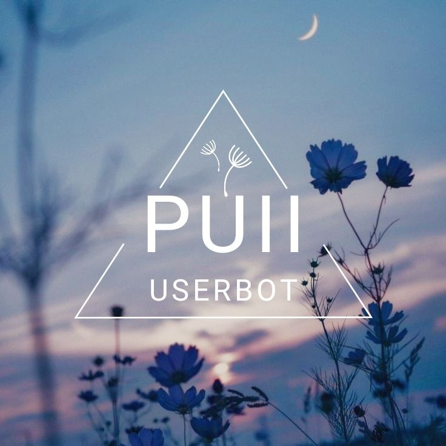

  

<h1 align="center">
  <b>Puii - UserBot</b>
</h1>
<h2 align="center">
<b>A stable pluggable Telegram userbot + Voice & Video Call music bot, based on Telethon.</b>
</h2>
   

----

# Deploy
- [Heroku](#deploy-to-heroku)
- [Okteto](#deploy-to-okteto)
- [Local Machine](#deploy-locally)

## Deploy to Heroku
Get the [Necessary Variables](#Necessary-Variables) and then click the button below!  

## Deploy to Okteto
Get the [Necessary Variables](#Necessary-Variables) and then click the button below!

## Deploy Locally
- [Traditional Method](#local-deploy---traditional-method)
- [Easy Method](#local-deploy---easy-method)
- [Ultroid CLI](#ultroid-cli)

### Local Deploy - Traditional Method
- Get your [Necessary Variables](#Necessary-Variables)
- Clone the repository:    
`git clone https://github.com/AellyXD/Puii.git`
- Go to the cloned folder:    
`cd Puii`
- Create a virtual env:      
`virtualenv -p /usr/bin/python3 venv`
`. ./venv/bin/activate`
- Install the requirements:      
`pip(3) install -U -r re*/st*/optional-requirements.txt`
`pip(3) install -U -r requirements.txt`
- Generate your `SESSION`:
  - For Linux users:
    `bash sessiongen`
     or
    `wget -O session.py https://git.io/JY9JI && python3 session.py`
  - For Termux users:
    `wget -O session.py https://git.io/JY9JI && python session.py`
  - For Windows Users:
    `cd desktop ; wget https://git.io/JY9JI -o puii.py ; python puii.py`
- Fill your details in a `.env` file, as given in [`.env.sample`](https://github.com/AellyXD/Puii/blob/main/.env.sample).
(You can either edit and rename the file or make a new file named `.env`.)
- Run the bot:
  - Linux Users:
   `bash startup`
  - Windows Users:
    `python(3) -m wa`

---
## Necessary Variables
- `SESSION` - SessionString for your accounts login session. Get it from [here](#Session-String)

One of the following database:
- For **Redis** (tutorial [here](./resources/extras/redistut.md))
  - `REDIS_URI` - Redis endpoint URL, from [redislabs](http://redislabs.com/).
  - `REDIS_PASSWORD` - Redis endpoint Password, from [redislabs](http://redislabs.com/).
- For **MONGODB**
  - `MONGO_URI` - Get it from [mongodb](https://mongodb.com/atlas).
- For **SQLDB**
  - `DATABASE_URL`- Get it from [elephantsql](https://elephantsql.com).

## Session String
Different ways to get your `SESSION`:

* TelegramBot : [@string_puiibot](https://t.me/string_puiibot)

---

# License
   
Ultroid is licensed under [GNU Affero General Public License](https://www.gnu.org/licenses/agpl-3.0.en.html) v3 or later.

---   
